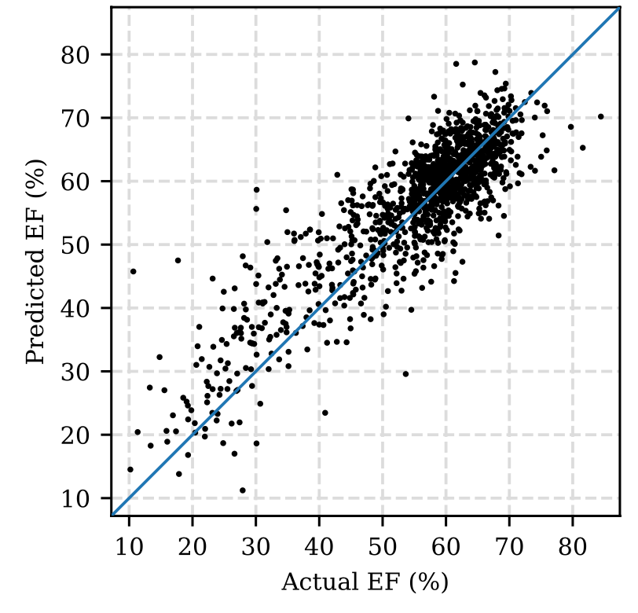

# report

## EchoNet-Dynamic

### Overview

> 共分为三个部分

$$
EF(\%) = \frac{EDV-ESV}{EDV}\times100\%
$$


1. **Segmentation**: 构建一个**具有空洞卷积的CNN模型用于左心室帧级级别的语义分割,用于标记左心室**
   + 针对图像语义分割问题中**下采样**会降低图像分辨率、丢失信息而提出的一种卷积思路。
   + 利用添加空洞扩大感受野，让原本3x3的卷积核，在相同参数量和计算量下拥有5x5或者更大的感受野，从而无需下采样
2. **Video**: 在Segmentation的训练基础上训练一个**具有残差连接和跨帧时空卷积的CNN模型来进行视频级(video-level)预测射血分数**

3. **Statistical Analysis**：在两者的基础上利用R语言统计方法**进行心脏功能的逐搏( beat-to-beat)估计**
   + 考虑到各种心脏条件下的负荷条件和心率变化可能引起心脏功能变化，建议对最多五个心动周期的射血分数进行估计
   + 模型识别每个心跳周期，生成一个**32帧的片段（ a clip of 32 frames）**，对每个心跳的射血分数的片段级估计进行平均作为测试时间的增加

### Model 

1. 对左心室划分部分采于Segmentation模型：
   + 作者采用了带有空洞卷积(atrous convolution)的网络模型 **deeplabv3_resnet50**

2. 在Segmentation的基础上，对心脏超声视频进行EF预测
   + 作者采用了**r2plus1d_18** 模型 

###Dataset

1. 数据集整体分为两部分: **视频数据以及 label 数据**。
2. 除此之外在code部分的datasets 模块专门设置了读取数据集的类和方法
3. 其中的label数据保存在两个CSV文件(表格)
   + Filelist.csv: 保存视频的基本格式数据以及**ESV**(左心室收缩末期容积)，**EDV**(左心室舒张末期容积)，**EF**(心脏射血率)
   + VolumeTracings.csv: 保存在一特定帧下的EDV和ESV的坐标线段用于在 **echo.py**中进行处理

## Reproduce

### Environmental preparation

1. 在 `requirements.txt`和`setup.py`目录下执行 `pip install --user .`
2. 由于本次实验数据集为avi视频资源且数量较多(8G+)，最终选择在AutoDL平台进行训练
   + 显卡为RTX A5000
   + 内存为50G
3. 数据集的读取与处理集成在`./dataset`下的`echo.py`
4. 数据集位于`./a4c-video-dir`下
   + 来源为Stanford的数据集网站
     + https://stanfordaimi.azurewebsites.net/datasets/834e1cd1-92f7-4268-9daa-d359198b310a
5. Segmentation的code位于`./utils` 下的`segmentation.py`
6. Video的code位于`./utils`下的`video.py`
   + 其中`./utils`下的5，6模块都集成在`..`下的`__main__.py`
7. 统计分析的code位于`./scripts`下的`beat_by_beat_analysis.R`

### Segmentation

1. 在`./echonet`目录下使用终端执行：

`	python __main__.py segmentation --num_epochs=30 --save_video --run_test  `

+ 笔者尝试过epochs为50的两次训练，其中最小loss均位于20-30的epochs之间，所以在正式训练次选用

`--num_epochs=30`

+ `--save_video`:保存带分段的视频,记录每帧左心室的估计大小和节拍开始的指标
+ `--run_test`：在训练结束之后运行测试

2. 输出目录为：`./output/segmentation/deeplabv3_resnet50_random/`

   + log.csv：训练和验证损失

   + best.pt：验证损失最低的模型的权重检查点

   + size.csv：每帧左心室的估计大小和节拍开始的指标

   + videos：包含带有分段叠加的视频的目录
   + test_dice.csv: 测试的准确率
   + val_dice.csv：评估的准确率

> results

+ 评估和测试的相似度：  	

+ Segmentation输出的典型样本`0X1A3D565B371DC573`（随机）

  ​									*带颜色的直线代表label中显示出的ES和ED的帧*

  <video src="assets/0X1A3D565B371DC573.avi"></video>

​											*实线代表计算的 ES，而虚线代表人类标记的 ES 和 ED*

### Video

1. 在`./echonet`目录下使用终端执行：

   `python __main__.py video --num_epochs=35 --run_test `

   + epochs数目的选择也是建立在预训练的基础上，最终采用35次的训练
   + 使用`run_test`来对最后回归网络的训练结果进行测试

2. 输出目录为：`./output/video/r2plus1d_18_32_2_pretrained`

   - log.csv：训练和验证损失
   - best.pt：验证损失最低的模型的权重检查点
   - test_predictions.csv：二次采样剪辑的射血分数预测

> test results

1. 这一部分的测试环节先后进行了两次测试:
   + 前者不采用数据增强，正常设置 batch_size--**one clip**
   + 而后者使用数据增强方法，将 batch_size 设置成1 --**all clip**
   + 最终将第二次测试的预测结果写入一个 csv 文件中(即一个视频的不同 clip 都有一个预测结果)


2. 绘制以标签 EF 和预测 EF 为横轴和纵轴的的散点图以及不同 thresh 为基准判断是否有心血管疾病的 AUC曲线

                            

​																									*以标签 EF 和预测 EF 为横轴和纵轴的的散点图*

+ **曲线下面积:** 

| Thresh |  Area   |
| :----: | :-----: |
|   35   | 0.9762  |
|   40   | 0..9741 |
|   45   | 0.9716  |
|   50   | 0.9525  |

### Statistical Analysis

1. 使用`./scripts/beat_analysis.R` 执行最终的逐拍预测和分析。 

+ 导入` segmentation `部分生成的` size.csv `文件，筛选出` ES `帧--ComputerSmall 为 1。

```R
sizeData <- read.csv("size.csv")

sizeData <- sizeData[sizeData$ComputerSmall == 1,]

str(sizeData)
```

+ 导入` video `部分的预测结果，找到包含该 `ES `对应帧的` clip `用于` Beat-by-beat `分析

2. `Statistical Analysis`是在`Segmentation`的分割基础之上作出的增强分析预测，并且加入了平均处理

> result

|                 | Mean | RMSE | R^2^  |
| --------------- | ---- | ---- | ----- |
| NoAugumentation | 4.13 | 5.33 | 0.809 |
| Beat-by-beat    | 4.02 | 5.23 | 0.815 |

+ Beat-by-beat 分析可以看成基于数据增强的进一 步工作，即对每一次心脏收缩的过程做一次预测，并 求取平均值。
+ 上表记录了 Beat-by-beat 分析的对比结果，可以看出各项指标都比单纯预测有了提升。

## Contrast

1. 原文结果分析

> our model accurately segments the left ventricle with a Dice Similarity Coefficient of 0.92, predicts ejection fraction with mean absolute error of 4.1%, and reliably classifies heart failure with reduced ejection fraction (AUC of 0.97)

2. 本实验复现的结果为：

   + Segmentation部分在large和overall基础的test下有0.9214的Dice相似度

   + Video模块对EF预测的平均误差为4.13%

   + AUC曲线在thresh在0.35-0.45区间均大于0.97

3. 总结

   + 复现结果均符合paper的原始结果

   + 在定性的大小到定量的误差比较中
     + 无论是Segmentation部分test的Dice相似度以及Video部分的prediction of EF又或是在Statistical Analysis部分的增强比较，本次实验都有较好的表现

## Change attempt

1. 因为Segmentation部分采用了很经典的Deeplab v3模型，并且对于原模型可能在卷积操作的 stride 以及 pool- ing 过程中的下采样导致图像的 feature map 分辨率缩小问题上作出了优化（导致对密集信息的语义分割效率低下）

   + 原作者采用了 Atrous Convolution的方法，并移除了常规的 pooling 操作，从而使得 feature map 分辨率保持在原始分辨率的 1/16 或 1/8 。

2. 由此，结合笔者期末了解了3D卷积（能够获取时空特征的直观手段，能够有效应用于有关video的任务）中的R2D,R3D,MCx等模型，原作者其实使用了其中的变式R(2+1)D,即一种混合卷积，利用2D卷积和1D卷积来逼近3D卷积。

   ​            											 

3. 最终，既然要选择进行3D卷积处理视频信息数据，而R3D作为经典C3D模型基础上使用ResNet网络的模型，其涉及到的卷积核和 feature map 为 4D，虽然有着更好的运动识别能力，但是面临的问题其实在于它比2D模型多了很多的参数，更加的难以训练。但是该project拥有一个大规模的数据集，所以采用R3D模型之后应该会有很好的运动识别能力

4. 最终，笔者决定在Video模块将原有的r2plus1d_18模型更改为r3d_18模型 -- model_name=r3d_18

### Result

1. EF预测统计分析

​										      	

​																				**r3d_18**

|             | Mean | RMSE | R^2^  |
| ----------- | ---- | ---- | ----- |
| R3d_18      | 4.07 | 5.44 | 0.802 |
| R2plus1d_18 | 4.13 | 5.33 | 0.809 |

2. AUC曲线下面积：

| Thresh | Area--R3d | Area--R2plus1d |
| :----: | :-------: | :------------: |
|   35   |  0.9775   |     0.9762     |
|   40   |  0.9777   |    0..9741     |
|   45   |  0.9743   |     0.9716     |
|   50   |  0.9614   |     0.9525     |

3. 以标签 EF 和预测 EF 为横轴和纵轴的的散点图

    								

​										**r3d_18**																						**r2plus1d_18**

## Summary

1. 本次项目分别训练了一个 左心室Segmentation模型和一个预测心脏射血率 EF 的识别模型，其效果超过了人类专家的平均水平，对心室医疗方面有显著的贡献，最终发表在了nature上
2. 本次复现的流程为注册下载数据集、将项目文件全部上传到远端服务器、进行环境准备（包括R语言及相关库）、进行Sementation部分的训练、进行Video部分的训练、最后利用R脚本进行统计分析
3. 本次复现过程中一个困扰了我很长时间的问题是，在进行训练的过程中，尤其是在Video最后部分的复现，会中途出现killed的情况，最开始我以为是显存不够，可能是batchsize过大，或者服务器的显存配置过小，但是后面通过调试发现在killed的训练部分batchsize反而是1，同时显存并没有溢出。最后查阅了很多文章和资料，发现有一种情况也会出现killed的情况：
   + 在多进程工作时，如果主进程采集完最后一个worker的batch，此时需要回去采集第一个worker产生的第二个batch。但是如果该worker此时没有采集完，主进程会卡在这里，会出现killed情况。
   + 这种情况往往出现在num_works数量少或者batchsize 比较小，显卡很快就计算完了，CPU对GPU供不应求。
   + 最终，我在训练完成后，选择超参--num_work=0（单进程）再resume进行test的训练，最终解决了问题
4. 本次实验让我不仅仅更加熟悉了pytouch，加深了对很多模型的理解，最重要的还是让我看到cv领域的很多先进结果在医疗领域的应用。当知识和技术最终可以应用在生活中可以看到的地方时才是最有意义和价值的。

